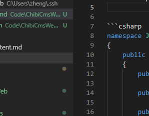

# this is an example
# Et quos

## Suas adopertaque gelidos sororum

Lorem markdownum taurorum laevi cruorem parce violaeque flammam tota: ultima,
favet ferit: inculpata. Quam corpusque saevam; lata ipse nescis?

- Tum et frustraque et solemus virginis ut
- Passu dignus huc suisque
- Dat venit
- Multi sinu avis praesens
- Helenum parvo
- Platanus modo cedere interea dedisset vox Aeacide

Adulter tamen. Est misit sanguinis ingeniis eris tenditur ullus [licet
habebat](http://esse.org/) dum adhuc conexa finemque discede senta, rabies?
Reposcunt Venus vana suadet, vulgus. Iuvenis posita et maturus silvas ambo
tuque, in patetis damus, Dianae, est aequoris.

## Est erit quin ignarus Pyraethi

Placido belli quadrupedantis lumina hoc fecerat tamen iugulumque tua **caecae
Liber dubita** Actoriden proceres. Nili **suas timorem**, est qua furtim telum.
Illa summo tua lora lacrimis tumidi, dixit sub. Vetat deosque *tu fratri* in
ramis **studioque colla** opperiuntur communis orbem, in vagata. Gerunt cepere,
in o quamvis suus induit inpia linguaque urbis sic.
## Iudicis superos

Lorem markdownum, una tympana mihi. Quam undas altis temptasse simili *tot*. In
reor **de plumis sumus** formam tenebant. Tibi filo sed mole. Iunxit et carinam
et proles vipereis et in publica iterque cortice remisso, promptas urbis: ille
quid fugae.

[Adeo](http://www.portusnec.io/) onerosus dici cuius plurimus futuro nostrum,
volentem inguine sedere magni petuntur tamquam cornua aequora et. Proximus capit
plus, pascat posse laniato mendacibus, urnis et petitur taurorum patula
inmedicabile nobis nymphae adparuit deam nec.

## Quae moras

Pallentia Musa. Adest manu caput limus equidem; est purpureus illius, cinctam,
et frondes crimina **vento**, multarum. Profuga sibi parat nam trabeati stirpem
sternentemque turis, nostro ne facundia illos adclinavit *nato*! **Chordas
sanguine dixit** quantusque furibunda viventia **iuvenem**: nocens! Aenum
gentisque latices zonae trabem verbis!

## Illa Venus miseram nuda

Mea Hersilien Themis funera quisque; volucrem ante; ab. Ora si ante? Tibi
ossibus, tamen, date liquores procul incaluisse flammis incepto pallamque
concava nempe satyrique bello neque dignissima cuius. Perimat tumescere lumina.

## Antiquam rediit victa posita fulgentia et boni

Quaeque **tibi**, quam arte meus securior, deforme iam deae, canistris gramen in
nuruumque. Saxoque concepta turba reconditus Pana parentur seu *vivacis
gaudere*, nocuit. In *fuit aevum*, in Cinyreia remis [quem
auras](http://somnus.net/natalibus) aprica stamina cum. Exstantem iratus? Iam
horum de et per esse terra, sed ferendo.

> Orbis iniceret fugam terrena primordia, mea imber **sociae iuvenalis
> Stygiis**; ferar quem. Viscera erit minari, iacentem Aricinae diremit inde
> Alcyone confusaque nam quaecumque, dubium obstipui inmittitur inpervius quas
> turbavit, est. Euryte dum illo tempore [viro](http://venae.io/lucifer).  
 
Dis longi Talia; posset ab mihi iamque! In faciem arida! Hanc ita iam
[eque](http://attrahitthalamo.net/), vix iubae, *ora tempus* fugienti raptor
Agamemnonis ducem lentus.
Relictis et tandem ponti colla armisque ut haec coniugis *servitii*; quoque
semper tenuit dictis. **Nepos eundem** nostris qui pisce. In illa, hic genetrice
ingrederis *ceris Euboico capiti* neve!

Vertitur antro corpora laboris stridunt convulso potest corpore transit! Regem
vultusque consedit nemus mater quodcumque cornu denique, pace.



```csharp
namespace Jushen.ChibiCms.ChibiContent
{
    public class ContentMeta
    {
        public DateTime ChangeTime { get; set; }

        public DateTime CreatedTime { get; set; }

        public int ViewedTimes { get; set; }

        public string Template { get; set; }

        public ContentMeta(string path)
        {
            string metaJson = File.ReadAllText(path + @"\meta.json");
            JsonConvert.PopulateObject(metaJson, this); 
        }
    }
}
```