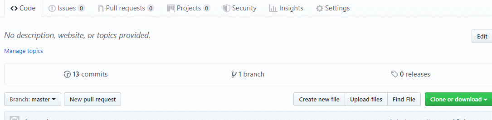

# ChibiCms

ChibiCms是一个非常简单的，如果不是最简单的一个flat file cms系统。基于asp.net core 2.1编写，支持Linux Win MacOS。他完全没有数据库，所有的内容都在文件中。通过复制粘贴来部署，也可以通过复制粘贴来备份。它通过Markdown方式写作，支持github webhook，可以把您的内容存在github中，只要push一下，它会自动的拉去最新的内容。支持多个github仓库，可以实现多人维护不同的区域内容。支持利用文件夹建立树形结构和在其中导航。不需要修改程序，就可以实现切换换模板，对不同的内容应用不同的模板。整个工程代码少得可怜不到1000行吧，我也没数过。

## 如何部署
1. 下载或clone本项目，或着点这里下载release版本。
2. 如果您用的源码，请自己编译VS2017，装了core 2.1以上sdk就可以，也可以装.net code的sdk直接编译额，编译的话是ChibiCmsWeb这个项目哈，release的话直接要到一个文件夹就可以。
3. 服务器需要装  .net core运行环境，[参考这个安装说明](https://dotnet.microsoft.com/learn/dotnet/hello-world-tutorial/install)
3. 把release的文件夹拷贝到您的服务器上，用下面的指令运行，不管您是啥系统windows linux都行
```bash
dotnet ChibiCmsWeb.dll
```
4. 建议您在linux上用systemd建一个服务，怎么弄网上很多这里给一个例子：
    1. 创建`/etc/systemd/system/chibicms.service`这个文件
    2. 内容如下：
    ```bash
    
        [Unit]
        Description=chibicms

        [Service]
        WorkingDirectory=/home/jushen/chibicms/release
        ExecStart=/usr/bin/dotnet /home/jushen/chibicms/release/ChibiCmsWeb.dll
        Restart=always
        RestartSec=10  # Restart service after 10 seconds if dotnet service crashes
        SyslogIdentifier=biochase-staging
        User=www-data
        Environment=ASPNETCORE_ENVIRONMENT=Production
        Environment=DOTNET_PRINT_TELEMETRY_MESSAGE=false

        [Install]
        WantedBy=multi-user.target
    ```
    **这里要注意，User这个字段一定要是对content下面所有的文件都有读写权限的，只读不行！**。因为修改日期之类的是系统自动生成要写进去的。  
    3. `sudo systemctl enable chibicms.service`  
        `sudo systemctl start chibicms.service`  


4. 好了已经好了，打开浏览器输入http://127.0.0.1:8003网址端口就可以使用了
5. 这个玩玩可以，如果您真的要放到internet上建议您用nginx做个反向代理，然后在加上https。

## 管理内容

这个东西的内容在wwwroot/contents下面，这个文件夹下面的内容都会被系统检索到。
1. 什么是内容  
内容就是一个文件夹，他兼备系统以网页的形式渲染出来。文件夹下面有两个非常重要的文件：

**content.md**: 这是一个markdown文件，就是您会显示在网页上的内容，文件名不能变，大小写敏感，请一定使用unicode编码，不然中文乱码。这个markdown会被渲染成HTML，如果您插入了图片，请把图片也放在这个文件夹下面，

**meta.json**: 这是这个内容的metadata，描述这个内容的，也可以存放一些其他额外的信息，先贴出文件内容，再详细解释一下(这个文件一样要是unicode编码)：
```json
{
  "WebPath": "not applicapable",
  "Title": "He Heh呵呵",
  "ChangeTime": "2019-06-10T19:46:34+08:00",
  "CreatedTime": "2019-03-24T22:45:57.0893043+08:00",
  "ViewedTimes": 0,
  "Template": null,
  "Author": null,
  "Cover": null,
  "Extras": {
    "photos": [
      "2019-03-16-01-05-20.png",
      "DSC_0840.jpg",
      "DSC_0841.jpg",
      "DSC_0842.jpg",
      "DSC_0843.jpg"
    ]
  },
  "TopPath": "没用别管",
  "ContentType": "Content"
}
```
首先这个里面有很多字段没什么用，是为了我自己方便些的，第一次访问会写在里面的一些字段，比如ChangeTime，WebPath，TopPath。  
再说有用的：
* **Title**： 这是你内容的标题，文章标题之类的；  
* **Template**: 这里是你这个内容渲染时用到的模板，默认就是null，会调用；  “defaultContentView”这个模板，如果你需要用别的模板，这里写你模板里面razor view的文件名，不带扩展名哈；  
* **Author**: 就是作者名，目前模板里没用到你可以自己修改模板显示；  
* **Cover**: 封面的图片，如果是null显示默认封面，这个默认封面是什么图的逻辑是下载模板里面的。如果不是null就是你指定的方面文件。这个逻辑其实也是卸载模板里面的。如果你用自带的ShutterView这个模板，默认封面在`wwwroot\ShutterView\images\DefaultCover.jpg`。如果你不用默认封面，这里填个文件名，然后把封面放在你的content文件夹下就行，当然你也可以写句对相对路径；  
* **Extras**： 这是一个`Dictionary<string,string>`类型变量，其他的模板会用到的数据可以放在这里。目前如果你使用自带的ShutterView，这里支持一个**Photos**字段，是一个string数组，用来显示这个帖子额外的照片，注意不是Markdown里面的照片，可以参考这个例子，这些图片都是在content目录下的；

**dmeta.json**
这个文件不是所有的内容都有，仅仅只有一种情况有，就是这个文件夹本身的类型是Content，但是他也是个目录在他的下面还有别的内容也就是说他也是个Directory，就放这如个文件来表示，他目前仅有Title是有意义的

2. 内容的类型
    1. **Content**  
        就是要展示的内容，他将使用你View目录下的contents下面的模板来显示。
    2. **Directory**  
        代表一个目录，用于导航，里面显示的都是链接，只想其他的内容。

3. 内容、目录的链接  
    1. **Content**  
    他对应的连接是\content\{paht},{path}是文件系统的相对路径，相对contents文件夹的
    例如\contents\my-contents\my-first-paper,对应的就是wwwroot\contents\my-contents\my-first-paper这个文件夹对应的内容。注意第一个contents是关键词，后面才是路径wwwroot\contents这是服务器文件系统上用于存放内容的路径，不能改。
    2. **Directory**  
    他对应的连接是\index\{paht},{path}是文件系统的相对路径，相对contents文件夹的
    例如\index\my-contents,对应的就是wwwroot\contents\my-content这个文件夹对应的内容。注意第一个index是关键词。这项将显示这个文件夹中所有的内容，你就可以通过这个导航到子文件夹中。
4. 隐藏内容  
  只要在文件夹中加入一个`hide.txt`这个文件，这个文件夹就不会再index的时候显示出来，但是你直接输入这个内容的网址还是可以看他的内容的，这个只是在索引的时候隐藏。

##  如何配置

ChibiCms有两个配置文件一个是hostsettings.json这个是配置监听ip和端口的，另一个是配置其他有用的东西的
### **hostsettings.json**
hostsettings.json这个是配置监听ip和端口的，内容如下：
```json
{
  "urls": "http://*:8003"
}
```
这个我不用说什么了吧"urls"后面跟您需要监听的ip和端口就行。
### **appsettings.json**
先贴出内容：
```json
{
  "StartPath": "example",
  "RootPath": "root",
  "TemplatePath": "/ShutterView",
  "ContentPathEnvVar": "ContentPath",
  "UpdateScripts": {
    "the-real-jushen/literature": "jushenLiterature.sh",
    "test": "test.bat"
  }
}
```
* **StartPath**： 这是你什么路径都不输入的时候，访问大服务器根路径是，对应的路径，据里如果`StartPath="my-contents/funny-stuff"`，那我输入`http://host:port/`的时候等于输入了`http://host:port/index/my-contents/funny-stuff`

* **RootPath**: 由于设置了StartPath，当你什么都不输入的时候访问的是特定的路径，那你就没有办法访问`wwwroot/contents/`这个目录了，除非`StartPaht`设置的就是这个。因此这个RootPath是一个暗号，当你输入这个按好的时候就能访问`wwwroot/contents/`了。例如上面代码这个例子，你输入那我输入`http://host:port/index/root`就能访问`wwwroot/contents/`。  
* **TemplatePath**：这是你模板View的路径，是相对可执行程序的路径，别搞错了不在wwwroot里面。  
* **ContentPathEnvVar**： 暂时没鸟用  
* **UpdateScripts** ：这是一个`Dictionary<string,string>`类型变量，特德key是你内容所在的github哭的完整名字（full name），另一个是用来更新的脚本名，在/wwwroot/updatescripts里面，当key对应的github库被push的是偶对应的脚本就会被之幸福。


## 如何通过Github更新
 首先ChibiCMS支持多人一起工作，就是在contents下面见多个文件夹，每个文件夹是一个github的repo，然后在**UpdateScripts**里面配置好对应的库对应什么脚本。
 举个例子：
 1. 首先你在本地建一个文件夹，里面放你所有的内容，可以有文件夹层级路径。
 2. 把这个本地文件夹 git init了，然后commit， push到github上，不用管是共有还是私有，都行。
 3. 然后去库里面设置webhook，地址填`http://yousite.zxy/api/webhook/gitupdate` ，然后类型一定要选`application/json`，确定添加，ok了 ，下面这个gif能动吧？ 
 
 4. 这个很重要了，更改appsetting.json里面的**UpdateScripts**，添加一个key value pair，key是你的repo的fuul name，value是一个更新脚本文件名，比如`update-my-content.sh`
 5. 在`/wwwroot/updatescripts`下面创建`update-my-content.sh`文件，内容如下：
 ```bash
 #!/bin/bash
#just for debug use
#touch jushenLiterature.update
# cd into the git folder
cd /home/jushen/JushenChibicms/wwwroot/contents/literature
# clean and reset before pull, why? when you access the content the modified time in meta.json can be changed for the first time, you don't whant this change be conflict to the remote file
git clean -d -f
git reset --hard
git pull
 ```
 最重要的是`cd /home/jushen/JushenChibicms/wwwroot/contents/literature`，这个把目录换到你想要自动更新的内容所存放的目录。  
 6. 给刚刚那个`update-my-content.sh`添加执行权限！  
 7. 创建`/home/jushen/JushenChibicms/wwwroot/contents/literature`这个目录，然后在里面运行`git clone 你的github库`  
  有几个问题：首先你要装了git，自己去装；第二你要生成一堆ssh key，把你的ssh publick key添加到github账号下，这个你应该也会，最后很多人都忘了的，要告诉系统使用这个key，由于运行网站的用户可能不是你当前用户，我建议把这个ssh key添加到所有用户使用：在`/etc/ssh/ssh_config`这个文件中加上一行`IdentityFile ~/.ssh/gitHubKey` gitHubKey是你的private key。参考：https://stackoverflow.com/questions/3466626/how-to-permanently-add-a-private-key-with-ssh-add-on-ubuntu， https://help.github.com/en/articles/generating-a-new-ssh-key-and-adding-it-to-the-ssh-agent  
  8. 好了你可以运行一下这个`update-my-content.sh`看有没有问题，没问题每当你push内容的时候网站会自动pull到网站服务器上。  
  9. 你可以添加多个脚本和多个github的repo到contents下面实现多人管理不同的分区。

## 如何修改模板
？？

## 未来计划
1. 可能会加入Docker支持，现在已经有了，但是我懒得晚上您可以自己加上然后给我个pull request


